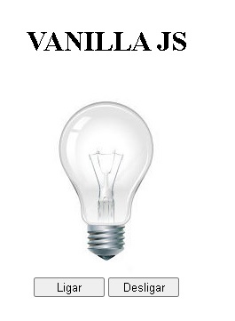
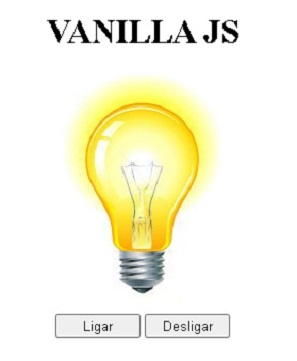
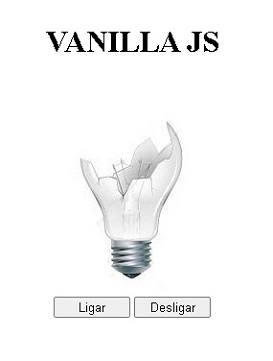

<h3 align="center">
  :leaves: Lampada :leaves:
</h3>

<h1 align="center">
  
  
  
    
    
    
</h1>

## :computer: Tecnologias utilizadas:

- 🥣 HTML.
- 🎃 CSS.
- ☕️ JAVASCRIPT.

## :fire: Instalação:

1. Clone este repositorio.

```sh
  $ git clone https://github.com/dienieper/lampada.git
```

## Contato:

- [LinkedIn](https://www.linkedin.com/in/dienieper-oliveira-98a7a4217/)
- [email](dienieper@outlook.com)
